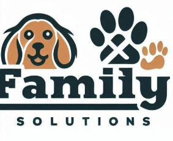
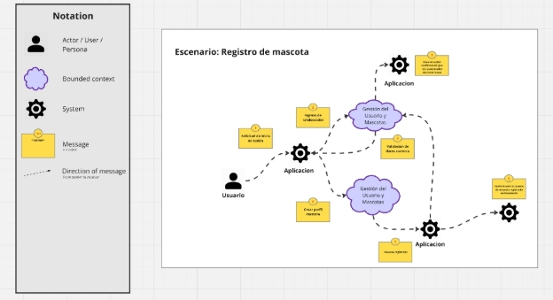
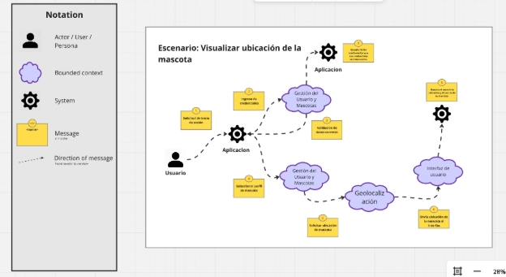
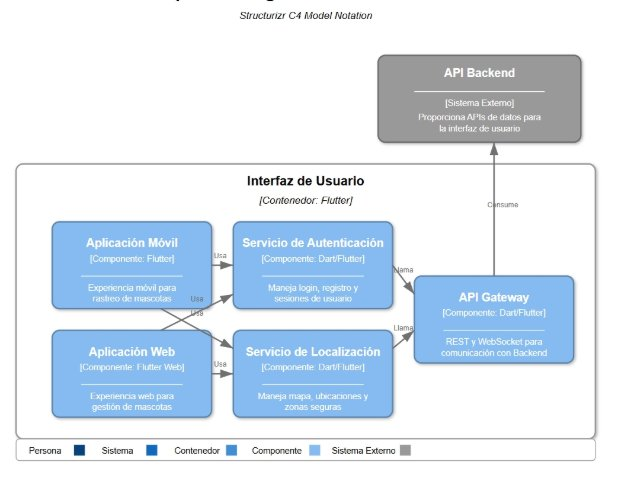

**Universidad Peruana de Ciencias Aplicadas** Ingeniería de Software 

8vo Ciclo 

**Desarrollo de Soluciones IOT** Sección: 2941

Profesor: Marco Antonio Leon Baca “INFORME DEL TRABAJO FINAL” Startup: Family Solutions 

Producto: CollarLink Integrantes: 

|Apellidos y Nombres del integrante |Código de Integrante |
| - | - |
|Ortiz Vera Gianfranco |U201916837 |
|Lobato Pozo, Sebastian Valente |U202215312 |
|Palma Obiso, Adrián Enrique Jesús |U202210066 |
|Carbajal Pozzo, Joaquín Alonso |U202121881 |
|Carrasco Godos, Juan Fernando |U20211D118 |

Abril, 2025 

Registro de Versiones 

A continuación se detalla los avances y las correcciones relevantes durante el desarrollo del proyecto FamilySolutions, donde demostramos nuestra participación dentro del ciclo de vida del proyecto.

|**Version** |**Fecha** |**Autor** |**Descripción de modificación** |
| - | - | - | - |
|**TB1** |` `26/04/2025 |
- Ortiz Vera Gianfranco 

- Lobato Pozo, Sebastian Valente 

- Palma Obiso, Adrián Enrique Jesús 

- Carbajal Pozzo, Joaquín Alonso 

- Carrasco Godos, Juan Fernando 
|
Se  han  incluido  los  siguientes capítulos dentro del desarrollo del proyecto: 

- Capitulo I: Introducción 

- Capitulo II: Requirements Elicitation & Analysis 

- Capitulo III: Requirements Specification 

- Capítulo IV: Product Architecture Design 
|

Project Report Collaboration Insights 

Contenido 

# Contenido

* [Registro de Versiones](#_page1_x69.00_y72.00)
* [Project Report Collaboration Insights](#_page2_x69.00_y72.00)
* [Contenido](#_page3_x69.00_y72.00)
* [Student Outcome](#_page4_x69.00_y535.00)
* [**Capítulo I: Introducción**](#_page7_x69.00_y72.00)
    * [1. Startup Profile](#_page7_x69.00_y106.00)
        * [1.1 Descripción de la Startup](#_page7_x69.00_y139.00)
        * [1.2 Perfiles de integrantes del equipo](#_page8_x69.00_y278.00)
    * [2. Solution Profile](#_page10_x69.00_y72.00)
        * [1.2.2 Antecedentes y problemática](#_page10_x69.00_y97.00)
    * [3. Segmentos objetivo](#_page16_x69.00_y72.00)
* [**Capítulo II: Requirements & Analysis**](#_page17_x69.00_y72.00)
    * [1. Competidores](#_page17_x69.00_y102.00)
    * [2. Entrevistas](#_page19_x69.00_y295.00)
        * [2.1 Diseño de entrevistas](#_page19_x69.00_y319.00)
        * [2.2 Registro de entrevistas](#_page21_x69.00_y96.00)
        * [2.3 Análisis de entrevistas](#_page22_x69.00_y455.00)
    * [3. Needfinding](#_page23_x69.00_y72.00)
        * [3.1 User Personas](#_page23_x69.00_y97.00)
        * [3.2 User Task Matrix](#_page23_x69.00_y660.00)
        * [3.3 User Journey Mapping](#_page26_x69.00_y72.00)
        * [3.4 Empathy Mapping](#_page27_x69.00_y98.00)
        * [3.5 As-is Scenario Mapping](#_page28_x69.00_y72.00)
    * [4. Ubiquitous Language](#_page28_x69.00_y259.00)
* [**Capítulo III: Requirements Specification**](#_page29_x69.00_y72.00)
    * [1. To-Be Scenario Mapping](#_page29_x69.00_y102.00)
    * [2. User Stories](#_page30_x69.00_y72.00)
    * [3. Impact Mappings](#_page43_x69.00_y72.00)
    * [4. Product Backlog](#_page44_x69.00_y72.00)
* [**Capitulo IV: Strategic-Level Software Design**](#_page48_x69.00_y72.00)
    * [1. Strategic-Level Attribute-Driven Design](#_page48_x69.00_y95.00)
        * [4.1.1 EventStormingz](#_page48_x69.00_y237.00)
    * [2. Candidate Context Discovery.](#_page50_x69.00_y572.00)
    * [3. Domain Message Flows Modeling.](#_page51_x69.00_y464.00)
    * [4. Bounded Context Canvases.](#_page53_x69.00_y642.00)
    * [5. Context Mapping](#_page54_x69.00_y382.00)
    * [6. Tactical-Level Domain-Driven Design](#_page55_x69.00_y448.00)
        * [6.1 Bounded Context: Geolocalización y Monitoreo](#_page55_x69.00_y497.00)
        * [6.2 Bounded Context: Gestión de Usuario y Mascotas](#_page59_x69.00_y72.00)
        * [6.3 Bounded Context User Interface (UI)](#_page64_x69.00_y98.00)
    * [7. Software Architecture](#_page70_x69.00_y96.00)
        * [7.1 Software Architecture System Landscape Diagram](#_page70_x69.00_y121.00)
        * [7.2 Software Architecture Context Level Diagrams](#_page70_x69.00_y383.00)
        * [7.3 Software Architecture Container Level Diagrams](#_page72_x69.00_y72.00)
        * [7.4 Software Architecture Deployment Diagrams](#_page73_x69.00_y392.00)
* [Conclusiones](#_page74_x69.00_y72.00)
* [Referencias BibliográficasAnexos](#_page74_x69.00_y157.00)

Student Outcome** 

El curso contribuye al cumplimiento del Student Outcome ABET:  

**ABET – EAC – Student Outcome 5** 

Aprendizaje continuo y autónomo  

Criterio:  La  capacidad  de  funcionar  efectivamente  en  un  equipo  cuyos  miembros  juntos proporcionan  liderazgo,  crean  un  entorno  de  colaboración  e  inclusivo,  establecen  objetivos, planifican tareas y cumplen objetivos. En el siguiente cuadro se describe las acciones realizadas y enunciados de conclusiones por parte del grupo, que permiten sustentar el haber alcanzado el logro del ABET – EAC - Student Outcome 5. 

|**Criterio Específico** |**Acciones Realizadas** |**Conclusiones** |
| :- | - | - |
|Trabaja  en equipo  para proporcionar liderazgo  en forma conjunta |
**TB1** 

**Joaquín  Carbajal:**  Ayudé  a  organizar  el documento,  asignar  tareas  y  desarrollar actividades en conjunto.  

**Adrián Palma:** Ayudé en la retroalimentación del product backlog, participé activamente en las  reuniones,  avancé  en  el  desarrollo  del Product Backlog y del Business Model Canvas, además de trabajar en el Bounded Context de Interfaces  de  Usuario,  incluyendo  la 

elaboración de los diagramas de componentes, clases y bases de datos. 

**Sebastian Lobato:** Fomenté el trabajo en equipo al organizar las sesiones de Event Storming, donde me aseguré de que todos participaran. También impulsé las reuniones de avance, creando un espacio para que compartiéramos ideas y tomáramos decisiones juntos. 

**Gianfranco  Ortiz  Vera:**  Elaboré  el  primer capítulo y una parte del segundo, ayudé con las reuniones de equipo. 

**Juan  Carrasco:**  Participé  activamente  en  la elaboración de los User Stories y en la creación de los diagramas de arquitectura de software. Coordiné y colaboré con el equipo para definir y estructurar las necesidades del proyecto.** 
|El trabajo en equipo fue fundamental para repartir responsabilidades  de manera  equilibrada. Ambos  miembros proporcionaron liderazgo en  diferentes  áreas, permitiendo  avanzar  de forma conjunta hacia los objetivos del proyecto. |

|Crea  un  entorno colaborativo  e inclusivo, establece  metas, planifica tareas y cumple objetivos. |
**TB1** 

**Joaquín Carbajal:** Hice las User Stories y uno de  los  Bounded  Context  para  cumplir  los objetivos  grupales  y  permitir  que  mis  demás compañeros  logren  sus  propias  metas  en conjunto. 

**Adrián Palma:** Contribuí en la planificación y cumplimiento  de  los  objetivos  mediante  el avance del Product Backlog, el desarrollo del Business  Model  Canvas  y  la  realización completa del Bounded Context de Interfaces de Usuario,  incluyendo  los  diagramas  de componentes, clases y base de datos. 

**Sebastian Lobato:** Lideré las entrevistas con los usuarios y el análisis de los resultados, y mi trabajo en el Impact Mapping ayudó a establecer metas  claras  y  a  planificar  las  tareas  para cumplir con los objetivos del proyecto. 

**Gianfranco  Ortiz  Vera:**  Hice  uno  de  los bounded context y también trato de generar un ambiente tranquilo para mis compañeros 

**Juan Carrasco:** Contribuí a crear un ambiente de  trabajo  donde  todas  las  ideas  fueron consideradas.  Organicé  las  tareas  asignadas para  la  redacción  de  User  Stories  y  la realización de los diagramas.** 
|Gracias a la colaboración continua, la planificación adecuada  y  el  apoyo mutuo, se logró cumplir con las metas propuestas de  manera  efectiva, manteniendo  un  entorno de  trabajo  inclusivo  y organizado. |
| :- | - | - |

Capítulo I: Introducción 

1. Startup Profile 
1. Descripción de la Startup

Family Solutions es un startup enfocado en el desarrollo de soluciones tecnológicas que fortalezcan la seguridad y el bienestar familiar. Nuestro primer producto es una innovadora aplicación móvil que se conecta a un dispositivo IoT ubicado en el collar de las mascotas, permitiendo a los dueños monitorear su ubicación en tiempo real. 

CollarLink envía alertas automáticas si la mascota se aleja de una zona segura predefinida, como el hogar, brindando tranquilidad y una respuesta rápida ante posibles escapes o extravíos. Con una interfaz amigable y funciones personalizadas, nuestra solución está diseñada para ser accesible y útil para todas las familias que consideran a sus mascotas como un miembro más del hogar. 

En Family Solutions, creemos que la tecnología puede ser una aliada poderosa para cuidar a quienes más queremos. 

**Misión:** Desarrollar soluciones tecnológicas accesibles e innovadoras que fortalezcan la seguridad y el bienestar del núcleo familiar, comenzando por el cuidado y protección de las mascotas a través de dispositivos inteligentes conectados. 

**Visión:** Ser referentes en el desarrollo de tecnología familiar inteligente en América Latina, ofreciendo productos confiables que promuevan una convivencia segura, conectada y armoniosa entre personas y sus mascotas. 

Logo de Family Solutions 

![ref1]

Logo de CollarLink 

2. Perfiles de integrantes del equipo 

|**Integrantes** |**Descripción** |**Conocimientos** |
| - | - | - |
|
Joaquín Alonso Carbajal 

Pozzo 
|Soy estudiante de 7mo ciclo de la carrera de Ingeniería de Software. Me gusta el desarrollo backend y las metodologías ágiles. |Conocimiento en Backend en Java, C++ y bases de datos en SQL y MongoDB. |
|**Gianfranco Ortiz Vera** |
Mi nombre es Gianfranco Ortiz Vera, soy estudiante próximo a egresar de la carrera de Ingeniería de Software. Me interesa mucho el desarrollo de backend, el manejo de bases de datos y la cyberseguridad. 

Me considero una persona humana y no puedo dormir si sé que tengo una tarea pendiente. 
|
Conocimiento en Backend en C#, C++, Python y bases de datos en SQL y MongoDB. Conocimiento basico de Javascript, Rust, Lua y COBOL. 

Habilidades en uso de herramientas de cyberseguridad. 
|

|**Adrián Enrique Jesús Palma Obispo** |Estudiante de 19 años apasionado por la creatividad e innovación de mi carrera |C#, C++, javascript, python, html y css |
| :- | :- | :- |
|**Sebastian Valente Lobato Pozo** |Soy un estudiante de 20 años de carrera de igenieria de software. Me gusta el desarrollo frontend, análisis de datos, automatizar procesos con python y el manejo de base de datos. |Java, Dart, Python, SQL, LUA, Librrerias/Frameworks como Pandas, React, Flutter. |

2. Solution Profile 
2. Antecedentes y problemática 
- **What (Qué)** 

Muchas mascotas, especialmente perros y gatos, se escapan o se alejan de casa sin que sus dueños lo noten a tiempo, lo que puede llevar a que se pierdan, sufran accidentes o nunca regresen. 

- **When (Cuándo)** 

En  cualquier  momento  del  día,  especialmente  cuando  las  puertas  o  portones  quedan abiertos,  durante  paseos  sin  correa,  en  eventos  con  fuegos  artificiales,  o  cuando  las mascotas se asustan por ruidos fuertes y huyen. 

- **Where (Dónde)** 

Tanto en zonas urbanas como rurales. Es común en barrios residenciales, casas con jardín, parques, playas o zonas sin cerco. 

- **Who (Quién)** 

A dueños de mascotas: familias, personas solteras, adultos mayores y niños que conviven con animales y desarrollan un vínculo afectivo con ellos. 

- **Why (Por qué)** 

Porque  las  mascotas  son  miembros  importantes  de  la  familia,  y  su  pérdida  genera sufrimiento emocional, tiempo invertido en buscarlas, e incluso puede representar un riesgo para su vida (atropellos, robo, maltrato, etc.). 

- **How (Cómo)** 

Las mascotas se escapan por una puerta mal cerrada, saltan una reja, rompen su correa o simplemente se alejan durante un paseo sin supervisión adecuada. Muchas veces esto ocurre sin que los dueños lo noten inmediatamente. 

- **How much (Cuánto)** 

Se estima que millones de mascotas se pierden cada año a nivel mundial. La mayoría no lleva identificación visible ni sistemas de rastreo, y un gran porcentaje no es recuperado. Esto  genera  angustia  emocional,  pérdida  económica  (por  recompensa  o  gastos  de búsqueda), y en muchos casos, el animal no sobrevive. 

3. Lean UX Process

En el desarrollo de una solución en IoT para localizar a tu mascota en tiempo real, se identificaron varios problemas recurrentes que afectan la experiencia del usuario. Estos problemas reflejan las dificultades que enfrentan los usuarios al mantener sus mascotas vigiladas, especialmente cuando no están en casa por motivos de trabajo o viajes, donde es crucial saber dónde están a cada momento. 

Hemos observado distintos usuarios con sistemas similares y métodos sin soluciones IoT, se han detectado áreas clave  que generan  frustración y pérdida de  tiempo. Entre ellas está  la poca precisión al localizar a sus mascotas, la interfaz del usuario confusa o poco intuitiva, la falta de feedback para saber si el dispositivo está funcionando correctamente y la falta de personalización de zonas seguras. Además del retraso de las notificaciones y alertas. 

La comprensión de estos problemas ha sido fundamental para definir el enfoque de Lean UX en el desarrollo de nuestra plataforma, orientado a resolver estas dificultades con soluciones prácticas y efectivas,  que  proporcionen  una  experiencia  de  usuario  más  satisfactoria  y  eficiente  en  la localización de mascotas. 

1. *Lean UX Problem Statement* 
- Hemos  observado  que  los  usuarios  se  sienten  frustrados  por  la  falta  de  precisión  y actualizaciones en tiempo real en los sistemas de rastreo de mascotas, lo que genera ansiedad y demora en reaccionar cuando una mascota se aleja. 
- Hemos notado que los usuarios expresan frustración por la dificultad de configurar zonas seguras personalizadas y recibir alertas oportunas, lo que compromete la eficacia del sistema ante posibles fugas. 
- Hemos detectado que los usuarios esperan una experiencia de uso más fluida y confiable, con  interfaces  intuitivas  y  dispositivos  cómodos  para  sus  mascotas,  evitando  así  la dependencia de soluciones poco prácticas o confiables. 
2. *Lean UX Assumptions* Business Assumptions: 
1. Los dueños de mascotas valoran una solución de rastreo en tiempo real más precisa y confiable que la mayoría de las opciones actuales disponibles en el mercado. 
1. Los usuarios están dispuestos a pagar por un dispositivo IoT y una app si esto les garantiza tranquilidad y una mayor probabilidad de recuperar a su mascota en caso de fuga. 
1. Una interfaz simple, intuitiva y personalizable aumenta la adopción y uso constante de la aplicación por parte de los usuarios no necesariamente técnicos. 
1. Los usuarios prefieren recibir alertas automáticas y personalizables cuando su mascota sale de una zona segura, en lugar de tener que monitorear manualmente. 
1. La comodidad del dispositivo para la mascota influye directamente en la satisfacción del usuario y en el uso continuo del producto. 
1. La integración de funcionalidades familiares o multicuenta (para compartir el monitoreo con otros miembros del hogar) incrementa el valor percibido de la app. 
1. Existen  mercados  dispuestos  a  adoptar  soluciones  tecnológicas  de  protección  para mascotas, incluso fuera de contextos urbanos, como zonas rurales o suburbanas. 

**User Assumptions: ¿Quién es el usuario?** 

Nuestros usuarios son personas que consideran a sus mascotas parte importante de su familia, especialmente dueños de perros o gatos que tienen acceso a exteriores (jardines, calles, parques, etc.). También pueden incluir familias, personas solteras o adultos mayores preocupados por la seguridad de sus animales. 

**¿Qué características son importantes?** 

- Actualizaciones en tiempo real 
- Alertas automáticas ante posibles fugas 
- Una interfaz clara y fácil de usar 
- Dispositivos pequeños, cómodos y seguros para su mascota 
- Confiabilidad del sistema (sin errores críticos o desconexiones) 

**¿Dónde encaja nuestro producto en su trabajo o vida?** 

El producto encaja en su vida diaria como una herramienta de tranquilidad y supervisión pasiva. Lo  usan  para  estar  informados  del  paradero  de  su  mascota  sin  necesidad  de  revisarla constantemente, sobre todo cuando están en casa, en el trabajo, de viaje o dejando a la mascota al cuidado de alguien más. 

**¿Cuándo y cómo es nuestro producto usado?** 

Nuestro producto será utilizado por el segmento objetivo cuando no tenga una forma de supervisar su mascota de forma directa. La aplicación también notifica al usuario a través de su smartphone si es que su mascota sale de la zona asignada. 

**¿Cómo debe verse nuestro producto y cómo debe comportarse?** 

La  apariencia  y  comportamiento  deseado  de  CollarLink  debe  enfocarse  en  la  usabilidad  y eficiencia para vigilar mascotas, la interfaz de usuario debe ser simple y clara, con un diseño intuitivo que permita a los usuarios navegar fácilmente por la aplicación y acceder a todas las funciones importantes sin confusión. Por otro lado, debe verse como una aplicación limpia, organizada y con funcionalidades claras y directas que faciliten la vigilancia de mascotas. 

**Feature Assumptions:** 

- Creemos que la aplicación debe contar con una interfaz intuitiva y accesible para todos los perfiles de usuario, por lo que las características se desarrollan teniendo en cuenta la simplicidad visual, íconos claros y flujos de navegación directos. 
- Creemos que la app debe mostrar la ubicación de la mascota en tiempo real con alta precisión,  por  lo  que  las  características  incluyen  integración  con  tecnología  GPS optimizada y actualizaciones constantes del mapa. 
- Creemos que los usuarios necesitan ser alertados inmediatamente si su mascota se aleja de una  zona  segura,  por  lo  que  las  características  incluyen  geocercas  personalizables  y notificaciones automáticas en tiempo real. 
- Creemos que la batería del dispositivo es una preocupación clave para los usuarios, por lo que las características del sistema contemplan un consumo energético eficiente y opciones para visualizar el estado de carga en la app. 
- Creemos que varios miembros de una familia podrían querer monitorear a la mascota, por lo  que  las  características  incluyen  acceso  multicuenta  o  compartido  para  permitir  la supervisión desde distintos dispositivos. 
- Creemos que los usuarios valoran poder revisar el historial de ubicaciones de su mascota, por lo que las características incluyen un registro visual del recorrido diario de la mascota en el mapa. 
3. *Lean UX Hypothesis* 

**Hypothesis  Statement  01:** Creemos que, si mostramos la ubicación de la mascota en tiempo real a través de un mapa interactivo, los usuarios se sentirán más tranquilos al saber dónde está su mascota en todo momento. Sabremos que hemos tenido éxito cuando aumente el uso diario de la aplicación y disminuyan los reportes de pérdida de mascotas entre nuestros usuarios. 

**Hypothesis  Statement  02:** Creemos que si implementamos alertas automáticas cuando la mascota salga de una zona segura, los  usuarios  reaccionarán  más  rápido  ante  posibles  fugas. Sabremos que hemos tenido éxito cuando la mayoría de las alertas sean vistas y respondidas por los usuarios en menos de 1 minuto y los casos de recuperación de mascotas aumenten. 

**Hypothesis  Statement  03:** Creemos que, si el proceso de vincular el dispositivo IoT con la app es simple e intuitivo, los usuarios  completarán  la  configuración  inicial  sin  asistencia  externa. Sabremos  que  hemos  tenido  éxito  cuando  al  menos  el  80%  de  los  usuarios  configuren  su dispositivo correctamente en el primer intento. 

**Hypothesis  Statement  04:** Creemos que, si permitimos que varios miembros de una familia puedan acceder al mismo perfil de  mascota,  los  usuarios  se  sentirán  más  acompañados  en  el  cuidado  de  su  animal. Sabremos que hemos tenido éxito cuando aumente el número de cuentas compartidas por mascota y se registre actividad de monitoreo desde múltiples dispositivos. 

4. *Lean UX Canvas* 

El Lean UX Canvas es una herramienta utilizada en el campo del diseño centrado en el usuario (UX) y la metodología Lean para crear y desarrollar productos de manera más eficiente y efectiva. Su  objetivo  es  proporcionar  un  marco  estructurado  para  la  colaboración  entre  equipos multidisciplinarios. A continuación, se presenta el Lean UX Canvas trabajado por el equipo a través de la herramienta digital Mural: 

[Lean UX Canvas CollarLink ](https://app.mural.co/t/leanuxcanvas2270/m/leanuxcanvas2270/1745637101243/10b199b5d5f0698f9d1973ecebe5a213a4db2fc8?sender=u35380281691571ebab4e3769)

3. Segmentos objetivo** 

Los segmentos objetivo de CollarLink consiste en personas o familias que tienen mascotas, estas personas trabajas y están fuera casi todo el día y no tienen tiempo para vigilar a sus mascotas. Aquí hay algunos segmentos específicos que podrían formar parte del público objetivo de CollarLink: 

**Dueños de mascotas urbanas con espacios abiertos:**  Personas que viven en casas con jardín o acceso a exteriores, donde sus mascotas pueden salir fácilmente. Les preocupa que sus mascotas se escapen o se pierdan. 

**Familias con niños y mascotas:** Hogares donde las mascotas son parte del entorno familiar. Valoran la seguridad y buscan tranquilidad al saber que la mascota está protegida sin tener que estar pendientes todo el tiempo. 

**Personas mayores o solteras que viven con una mascota:** Tienen a su mascota como principal compañía y desean soluciones tecnológicas que les den control y seguridad sin complicaciones. 

**Amantes de los animales con afinidad tecnológica:** Usuarios que ya utilizan apps de salud o gadgets para sus mascotas (alimentadores automáticos, cámaras, GPS), y están dispuestos a pagar por soluciones inteligentes que mejoren su cuidado.

Capítulo II: Requirements & Analysis 

1. Competidores

 

<table><tr><th colspan="9"><b>Competitive Analysis Landscape</b> </th></tr>
<tr><td colspan="2" rowspan="2">¿Por qué llevar a cabo este análisis? </td><td colspan="7">¿Quiénes son nuestros principales competidores? </td></tr>
<tr><td colspan="7">Gracias al análisis de la competencia, se logra comprender el entorno competitivo en el que operará nuestro producto. Esto proporciona una visión detallada de quienes son nuestros competidores directos e indirectos, logrando así, trazar una estrategia sólida para alcanzar la máxima exposición de nuestro producto, llegando así a más posibles consumidores. </td></tr>
<tr><td colspan="1" valign="top"><b>Perfil</b> </td><td colspan="2" valign="top"><b>Overview</b></td><td colspan="1" valign="top">
<b>CollarLink</b> 

![ref2]
</td><td colspan="1">
<b>Fi Smart Dog Collar</b> 

</td><td colspan="2" valign="top">
<b>Whistle Go Explore</b> 

</td><td colspan="3" valign="top">
<b>Weenect Pets</b> 

</td></tr>
<tr><td colspan="1" rowspan="3"></td><td colspan="2"></td><td colspan="1" valign="top">La aplicación que estamos desarrollando, consiste en un collar que se podrá conectar a cualquier dispositivo móvil. </td><td colspan="1">Collar inteligente para perros que ofrece seguimiento GPS en tiempo real, monitoreo de actividad y sueño, con una batería de larga duración. </td><td colspan="2" valign="top">Dispositivo de rastreo GPS y monitoreo de salud para perros y gatos, con funciones adicionales como luz nocturna y alertas de actividad. </td><td colspan="3" valign="top">Pequeño rastreador GPS para perros y gatos que ofrece seguimiento en tiempo real y funciones adicionales como llamadas al dispositivo.</td></tr>
<tr><td colspan="9">Competitive Analysis Landscape </td></tr>
<tr><td colspan="2" valign="top">
Ventaja Competitiva ¿Qué valor 

ofrecen a los clientes? 
</td><td colspan="1">Dispositivo versátil con opción de conectarse a una variedad de equipos </td><td colspan="2">Destaca por su batería de hasta un mes de duración y diseño robusto y resistente al agua. </td><td colspan="2">Ofrece una combinación de seguimiento de ubicación y monitoreo de salud en un solo dispositivo, sin necesidad de una estación base. </td><td colspan="2">Ofrece funciones únicas como la capacidad de llamar al dispositivo y recibir alertas de batería baja, con precios competitivos. </td></tr>
<tr><td colspan="1">Perfil de Marketing </td><td colspan="2">Mercado Objetivo </td><td colspan="1">Dueños de mascotas en general que no </td><td colspan="2">Dueños de perros activos, especialmente aquellos que viven en </td><td colspan="2">Dueños de perros y gatos interesados en el bienestar integral de sus mascotas, </td><td colspan="2" valign="bottom">Dueños de perros y gatos que buscan </td></tr>
</table>

<table><tr><th colspan="1"></th><th colspan="2"></th><th colspan="2" valign="top">tienen tiempo para vigilarlas </th><th colspan="2" valign="top">áreas rurales o que realizan actividades al aire libre con sus mascotas.</th><th colspan="3" valign="top">especialmente aquellos preocupados por la salud y la actividad física. </th><th colspan="1" valign="top">una solución de rastreo asequible y funcional, especialmente en Europa.  </th></tr>
<tr><td colspan="1" rowspan="3" valign="top">Perfil del Producto </td><td colspan="2">
Productos 

& Servicios 
</td><td colspan="2">Collar IoT que se conectará a diferentes dispositivos mediante la aplicación Collarlink </td><td colspan="2" valign="top">Collar inteligente con módulo GPS, aplicación móvil para seguimiento y planes de suscripción para servicios de localización.</td><td colspan="3" valign="top">Dispositivo de rastreo GPS, aplicación móvil con funciones de monitoreo de salud, suscripción para servicios de localización y salud.</td><td colspan="1" valign="top">Dispositivo de rastreo GPS, aplicación móvil, suscripciones con diferentes planes de precios.</td></tr>
<tr><td colspan="2">Precios & Costos </td><td colspan="2" valign="top">Precio del dispositivo: S/. 59.90 Subscripción: S/. 24.90/mes </td><td colspan="2" valign="top">
Precio del dispositivo: $149.  

Suscripción: $99/año, $186/2 años o $248/3 años. 
</td><td colspan="3" valign="top">
Precio del dispositivo: $129.95. 

Suscripción: $9.95/mes o $99.95/año. 
</td><td colspan="1">Precio del dispositivo: £49.90. Suscripciones: £7.90/mes, £59.90/año o £89.90/2 años. </td></tr>
<tr><td colspan="2">Canales de distribución (web/móvil) </td><td colspan="2">Disponibles en el sitio web </td><td colspan="2">Disponible en línea a través de su sitio web y minoristas como Chewy.</td><td colspan="3">Disponible en línea a través de su sitio web y minoristas como Amazon y Walmart.</td><td colspan="1">Disponible en línea a través de su sitio web y minoristas como Amazon.</td></tr>
<tr><td colspan="11">Competitive Analysis Landscape </td></tr>
<tr><td colspan="2" rowspan="3">Análisis SWOT </td><td colspan="2">Fortalezas </td><td colspan="2">Una larga distancia de rastreo y la capacidad de delimitar geocercas </td><td colspan="2">Larga duración de batería, diseño duradero, múltiples zonas seguras configurables. </td><td colspan="1">Integración de seguimiento de salud y ubicación, batería de larga duración, sin necesidad de estación base. </td><td colspan="2">Funciones únicas como llamadas al dispositivo, precios competitivos, adecuado para gatos y perros pequeños. </td></tr>
<tr><td colspan="2">Debilidades </td><td colspan="2">La larga distancia podría afectar la precisión de rastreo y el intervalo de actualizaciones de rastreo. </td><td colspan="2">Requiere una estación base para cargar y establecer zonas seguras; solo compatible con collares de la marca Fi. </td><td colspan="1">Puede haber retrasos en las notificaciones cuando la mascota sale de la zona segura; no cuenta con interfaz web. </td><td colspan="2">Menor presencia en mercados fuera de Europa, diseño menos robusto en comparación con competidores. </td></tr>
<tr><td colspan="2">Oportunidades </td><td colspan="2">Expansión al mercado latinoamericano por la falta de </td><td colspan="2">Expansión a mercados internacionales y desarrollo de características </td><td colspan="1">Ampliar las funciones de monitoreo de salud y </td><td colspan="2">Expansión a mercados internacionales y desarrollo de nuevas </td></tr>
</table>

<table><tr><th colspan="1" rowspan="2"></th><th colspan="1"></th><th colspan="1" valign="top">competidores en esta área  </th><th colspan="1" valign="top">adicionales como monitoreo de salud.</th><th colspan="1" valign="top">expandirse a nuevos mercados.</th><th colspan="1" valign="top">funciones para mejorar la experiencia del usuario.</th></tr>
<tr><td colspan="1">Amenazas </td><td colspan="1">Competidores externos que entren al mercado </td><td colspan="1">Competencia creciente en el mercado de dispositivos de rastreo para mascotas y dependencia de la cobertura de la red LTE- M.</td><td colspan="1">Competencia de dispositivos con características similares y evolución tecnológica en el mercado de dispositivos de rastreo.</td><td colspan="1">Competencia de dispositivos con características más avanzadas y consolidación de marcas en el mercado de rastreo de mascotas.</td></tr>
</table>

2. Entrevistas
1. Diseño de entrevistas

Preguntas generales:  

¿Cuál es su nombre?  

¿Cuántos años tiene?  

¿En qué ciudad y distrito reside actualmente?  

¿Cuál es su ocupación actual?  

¿Tiene alguna mascota? ¿Cuantas? 

¿Qué tanto viaja al año? ¿Lleva a su macota? 

Preguntas respecto a mascotas 

¿Ha contratado algún servicio de paseador de perros? (Solo si tiene perros de mascota) ¿Qué tanto confía en el servicio? (Solo si tiene perros de mascota) 

¿Alguna vez se le ha escapado una mascota? ¿Qué ha hecho para encontrarla? 

¿Utiliza algún sistema o servicio para vigilar a su mascota mientras usted no está en casa? ¿Lo recomendaría? 

**Explicar sobre la aplicación que estamos desarrollando CollarLink** ¿Usaría esta aplicación si sale al mercado? 

¿Qué función recomendaría añadir? 

2. Registro de entrevistas

Entrevista 1:  

Nombre: Alison Garrido Edad: 21 

Enlace de la entrevista: 

[https://upcedupe- my.sharepoint.com/:v:/g/personal/u202215312_upc_edu_pe/Ef6WaRQN9cpAkCaHh_Tyz6UBE jbWaanUIzqmB8LRsbOZRA?e=FbR9dz&nav=eyJyZWZlcnJhbEluZm8iOnsicmVmZXJyYWx BcHAiOiJTdHJlYW1XZWJBcHAiLCJyZWZlcnJhbFZpZXciOiJTaGFyZURpYWxvZy1MaW5 rIiwicmVmZXJyYWxBcHBQbGF0Zm9ybSI6IldlYiIsInJlZmVycmFsTW9kZSI6InZpZXcifX0 %3D ](https://upcedupe-my.sharepoint.com/:v:/g/personal/u202215312_upc_edu_pe/Ef6WaRQN9cpAkCaHh_Tyz6UBEjbWaanUIzqmB8LRsbOZRA?e=FbR9dz&nav=eyJyZWZlcnJhbEluZm8iOnsicmVmZXJyYWxBcHAiOiJTdHJlYW1XZWJBcHAiLCJyZWZlcnJhbFZpZXciOiJTaGFyZURpYWxvZy1MaW5rIiwicmVmZXJyYWxBcHBQbGF0Zm9ybSI6IldlYiIsInJlZmVycmFsTW9kZSI6InZpZXcifX0%3D)

Resumen de entrevista: 

Alison Garrido tiene 21 años, vive en Surco y trabaja en un call center de cobranza. Tiene tres mascotas: dos gatos (una hembra y un macho) y un perrito chihuahua. No viaja mucho durante el año, y cuando lo hace, suele dejar a sus mascotas al cuidado de alguien de confianza. 

Respecto a los servicios para mascotas, nunca ha contratado un paseador de perros porque siente desconfianza en dejar a su perrito con alguien desconocido. Una vez, uno de sus gatos se escapó, pero logró encontrarlo tras buscarlo en el vecindario y colocar avisos. Actualmente no utiliza sistemas de vigilancia para sus mascotas, aunque estaría interesada en uno. 

Cuando se le presentó **CollarLink**, la app que rastrea en tiempo real a las mascotas mediante un collar  inteligente,  Alison  mostró  gran  interés  y  afirmó  que  la  usaría,  especialmente  para  su chihuahua.  Sugirió  agregar  funciones  como  un  dispensador  de  comida  inteligente  o  una notificación de alimentación, así como un botón de emergencia que emita un sonido en el collar para ayudar a encontrar a la mascota más rápido. 

Entrevista 2: 

Nombre: Brayan Astoria 

Edad: 25 

Enlace de la entrevista: 

[https://upcedupe- my.sharepoint.com/:v:/g/personal/u202215312_upc_edu_pe/ESqYX0oIZq1ImwGuJJlklXAB1G GLRyl8ta4- 6uf0hlEDqA?e=MgGk9H&nav=eyJyZWZlcnJhbEluZm8iOnsicmVmZXJyYWxBcHAiOiJTdHJ lYW1XZWJBcHAiLCJyZWZlcnJhbFZpZXciOiJTaGFyZURpYWxvZy1MaW5rIiwicmVmZXJ yYWxBcHBQbGF0Zm9ybSI6IldlYiIsInJlZmVycmFsTW9kZSI6InZpZXcifX0%3D ](https://upcedupe-my.sharepoint.com/:v:/g/personal/u202215312_upc_edu_pe/ESqYX0oIZq1ImwGuJJlklXAB1GGLRyl8ta4-6uf0hlEDqA?e=MgGk9H&nav=eyJyZWZlcnJhbEluZm8iOnsicmVmZXJyYWxBcHAiOiJTdHJlYW1XZWJBcHAiLCJyZWZlcnJhbFZpZXciOiJTaGFyZURpYWxvZy1MaW5rIiwicmVmZXJyYWxBcHBQbGF0Zm9ybSI6IldlYiIsInJlZmVycmFsTW9kZSI6InZpZXcifX0%3D)

Resumen de entrevista: 

Bryan Astoria tiene 25 años, vive en San Juan de Miraflores, Lima, y trabaja como profesor de psicología en un colegio de Chorrillos. Tiene tres gatos. No viaja con frecuencia y, cuando lo hace, deja a sus gatos en casa con suficiente comida y supervisión ocasional. 

No ha contratado servicios de paseador de perros, ya que no tiene canes. En una ocasión, uno de sus gatos se escapó por la ventana; Bryan lo buscó por el vecindario, colocó carteles y preguntó a los vecinos, logrando que su gato regresara solo al día siguiente. Actualmente no usa sistemas de vigilancia  para  sus  mascotas,  pero  le  gustaría  contar  con  cámaras  o  sensores  para  mayor tranquilidad. 

3. Análisis de entrevistas

Las entrevistas con Bryan y Alison revelan un patrón común de preocupación y deseo de mayor seguridad en el cuidado de mascotas. Ambos entrevistados han experimentado la angustia de perder a sus mascotas, lo que subraya la necesidad de soluciones confiables de rastreo y vigilancia. Si bien sus perfiles difieren en cuanto a la tenencia de perros y el uso de servicios de terceros, ambos comparten un interés en la tecnología que les brinde tranquilidad. Alison, en particular, mostró un entusiasmo directo por CollarLink y aportó valiosas ideas para futuras funciones, como el dispensador de comida y el botón de emergencia. En conjunto, estas entrevistas validan la propuesta de valor de CollarLink y destacan la importancia de enfocarse en la autonomía del dueño, la tranquilidad mental y la exploración de funcionalidades adicionales que enriquezcan la experiencia del cuidado de mascotas. 

3. Needfinding 
1. User Personas 

Hemos observado que vamos a lidiar con un solo user persona, los dueños de mascotas o Dueños para acortar. 

2. User Task Matrix** 

|**TASK** |**Dueño de mascota** |
| - | - |

||**FREQUENCY** |**IMPORTANCE** |
| :- | - | - |
|Consultar ubicación actual de la mascota |Alta (varias veces al día) |Crítica |
|Recibir alertas de alejamiento de la zona segura |Media (ocasional, cuando sucede) |Crítica |
|Configurar zonas seguras (geocercas) |Baja (cuando se instala o se cambia de casa) |Alta |
|Consultar historial de ubicaciones |Media (semanal) |Media |
|Ver estado de la batería del dispositivo |Media (cada pocos días) |Alta |
|Configurar perfiles de mascotas (nombre, foto, raza) |Baja (solo configuración inicial o cambios raros) |Media |
|Ajustar notificaciones (sonido, vibración, tipo de alerta) |Baja (solo en ajustes) |Media |
|Actualizar firmware del dispositivo IoT |Muy baja (solo cuando se notifica) |Media |
|Contactar soporte técnico |Muy baja (solo si hay problemas) |Alta en caso de fallo |

3. User Journey Mapping** 

4. Empathy Mapping 

Técnica utilizada en el diseño UX y la investigación de usuarios para comprender mejor las necesidades, emociones y comportamientos de los usuarios. Mapa Visual que representa desde la perspectiva del usuario el recorrido de sus necesidades y deseos en la problemática reconocida. 

5. As-is Scenario Mapping 

[CollarLink As-Is Scenario Mapping ](https://miro.com/app/board/uXjVI91IZm8=/?share_link_id=950342037986)

4. Ubiquitous Language 

Capítulo III: Requirements Specification 

1. To-Be Scenario Mapping 

[CollarLink To-Be Scenario Mapping ](https://miro.com/app/board/uXjVI91db20=/?share_link_id=956394124092)

2. User Stories

|Story |Título |Descripción |Criterios de Aceptación ||Epic |
| - | - | - | - | :- | - |
|ID |||||ID |
|**Epic 1: Autenticación y gestión de usuarios**||||||
|` `**Como** usuario ||||||
|` `**Quiero** registrarme, iniciar sesión y gestionar mi cuenta||||||
|` `**Para** acceder de forma segura al sistema y proteger mis datos personales.||||||
|US01 |Registro de |Como usuario |**Escenario 1: Usuario crea una** ||1 |
||usuario |quiero acceder a |**cuenta** |||
|||un apartado de |` `Dado que el usuario ya está en la |||
|||registro para crear |pestaña de registro |||
|||una cuenta |` `Cuando el usuario ingrese sus datos|||
||||` `Entonces el sistema le creará una |||
||||cuenta |||
||||**Escenario 2: Usuario intenta** |||
||||**registrarse pero los datos son** |||
||||**inválidos** |||
||||` `Dado que el usuario ya está en la |||
||||pestaña de registro |||
||||` `Cuando el usuario ingrese sus datos|||
||||` `Entonces el sistema informará que |||
||||los datos son inválidos |||
|||||||
|US02 |Inicio de |Como usuario |**Escenario 1: Usuario inicia sesión** ||1 |
||sesión |registrado quiero |**exitosamente** |||
|||iniciar sesión con |` `Dado que el usuario ya está en la |||
|||mi correo y |pestaña de inicio de sesión|||
|||contraseña para |` `Cuando ingrese su correo y |||
|||acceder a mi |contraseña correctos|||
|||cuenta |` `Entonces el sistema lo redirigirá al |||
||||panel principal |||
||||**Escenario 2: Usuario ingresa** |||
||||**credenciales incorrectas**|||
||||` `Dado que el usuario ya está en la |||
||||pestaña de inicio de sesión|||
||||` `Cuando ingrese un correo o |||
||||contraseña incorrectos|||
||||` `Entonces el sistema mostrará un |||
||||mensaje de error |||
|||||||
|US03 |Cierre de |Como usuario |**Escenario 1: Usuario cierra sesión** ||1 |
||sesión |quiero cerrar |**correctamente** |||

|||sesión para ||` `Dado que el usuario está ||
| :- | :- | - | :- | - | :- |
|||proteger mi ||autenticado en el sistema||
|||información ||` `Cuando haga clic en el botón de ||
|||personal ||cerrar sesión ||
|||||` `Entonces el sistema lo redirigirá a la ||
|||||pantalla de inicio ||
|US04 |Recuperació|Como usuario ||**Escenario 1: Usuario solicita** |1 |
||n de |quiero recuperar mi ||**recuperación de contraseña**||
||contraseña |contraseña si la ||` `Dado que el usuario no recuerda su ||
|||olvido para poder ||contraseña ||
|||ingresar ||` `Cuando solicite un enlace de ||
|||nuevamente a mi ||recuperación e ingrese su correo||
|||cuenta ||` `Entonces el sistema enviará el ||
|||||enlace al correo proporcionado||
|||||**Escenario 2: Usuario intenta** ||
|||||**recuperar con un correo no** ||
|||||**registrado** ||
|||||` `Dado que el usuario está en la ||
|||||pantalla de recuperación de ||
|||||contraseña ||
|||||` `Cuando ingrese un correo no ||
|||||registrado ||
|||||` `Entonces el sistema mostrará un ||
|||||mensaje indicando que no existe ||
|||||cuenta con ese correo||
|||||||
|US05 |Edición de |Como usuario ||**Escenario 1: Usuario actualiza su** |1 |
||perfil |quiero editar mi ||**información exitosamente** ||
|||información ||` `Dado que el usuario está en la ||
|||personal para ||sección de perfil ||
|||mantener mi ||` `Cuando modifique sus datos y ||
|||cuenta actualizada||guarde los cambios ||
|||||` `Entonces el sistema actualizará su ||
|||||información y mostrará un mensaje ||
|||||de éxito ||
|||||**Escenario 2: Usuario intenta** ||
|||||**ingresar datos inválidos** ||
|||||` `Dado que el usuario está editando ||
|||||su perfil ||
|||||` `Cuando ingrese un dato inválido ||
|||||(por ejemplo, un correo mal escrito) ||
|||||` `Entonces el sistema mostrará un ||
|||||mensaje de error ||

||||||
| :- | :- | :- | :- | :- |
|**Epic 2: Gestión de mascotas y collares**|||||
|` `**Como** dueño de una mascota|||||
|` `**Quiero** registrar y administrar a mis mascotas y sus collares|||||
|` `**Para** poder rastrear su ubicación de forma personalizada.|||||
|US06 |Registro de mascota |Como usuario quiero registrar a mi mascota para poder asociarla con un dispositivo GPS |
**Escenario 1: Usuario registra una mascota exitosamente**

` `Dado que el usuario está en el apartado de registro de mascotas

` `Cuando ingrese los datos requeridos de la mascota

` `Entonces el sistema guardará la información y mostrará una confirmación 

**Escenario 2: Usuario intenta registrar mascota con datos incompletos** 

` `Dado que el usuario está registrando una mascota

` `Cuando deje campos obligatorios vacíos 

` `Entonces el sistema mostrará un mensaje de error solicitando completar los campos 
|2 |
|US07 |Edición de datos de mascota |Como usuario quiero editar los datos de mi mascota para mantener su información actualizada |
**Escenario 1: Usuario edita los datos correctamente** 

` `Dado que el usuario está en el perfil de su mascota 

` `Cuando modifique los datos y guarde los cambios 

` `Entonces el sistema actualizará la información de la mascota **Escenario 2: Usuario intenta ingresar datos inválidos** 

` `Dado que el usuario edita el perfil de su mascota 

` `Cuando ingrese datos incorrectos (por ejemplo, símbolos en el nombre) 

` `Entonces el sistema mostrará un mensaje de error 
|2 |

|US08 |Visualización de mascotas registradas |Como usuario quiero ver una lista de mis mascotas registradas para gestionarlas fácilmente |
**Escenario 1: Usuario visualiza la lista de mascotas** 

` `Dado que el usuario ha registrado al menos una mascota 

` `Cuando acceda a la sección de “Mis Mascotas” 

` `Entonces el sistema mostrará una lista con todas sus mascotas y sus datos básicos 
|2 |
| - | - | :- | :- | - |
|US09 |Eliminación de mascota |Como usuario quiero eliminar una mascota del sistema para gestionar solo las activas |
**Escenario 1: Usuario elimina una mascota con confirmación**

` `Dado que el usuario está viendo la lista de mascotas 

` `Cuando presione el botón de eliminar y confirme la acción 

` `Entonces el sistema eliminará la mascota de su cuenta

**Escenario 2: Usuario cancela la eliminación** 

` `Dado que el usuario ha hecho clic en eliminar 

` `Cuando cancele la acción en el cuadro de confirmación 

` `Entonces el sistema no eliminará la mascota 
|2 |
|US10 |Asociación de collar a una mascota |Como usuario quiero asociar un collar GPS a una mascota para poder rastrear su ubicación |
**Escenario 1: Usuario asocia un collar exitosamente** 

` `Dado que el usuario tiene un dispositivo GPS disponible 

` `Cuando seleccione la mascota y agregue el ID del collar 

` `Entonces el sistema vinculará el dispositivo a esa mascota

**Escenario 2: Usuario intenta asociar un collar ya vinculado a otra mascota** 

` `Dado que el usuario ingresa el ID del collar 

` `Cuando el collar ya esté registrado en otra cuenta 

` `Entonces el sistema mostrará un 
|2 |

||||mensaje indicando que el collar ya está en uso ||
| :- | :- | :- | :- | :- |
|**Epic 3: Ubicación y geolocalización en tiempo real**|||||
|` `**Como** usuario |||||
|` `**Quiero** ver la ubicación de mi mascota en tiempo real|||||
|**Para** saber dónde se encuentra en cada momento y actuar rápidamente si se aleja.|||||
|US11 |Visualizar ubicación de la mascota en tiempo real |Como usuario quiero ver la ubicación de mi mascota en tiempo real para saber dónde se encuentra en todo momento |
**Escenario 1: Usuario visualiza la ubicación actual** 

` `Dado que el collar de la mascota está encendido y conectado

` `Cuando el usuario accede al mapa desde la app 

` `Entonces el sistema mostrará un marcador con la ubicación actual de la mascota 

**Escenario 2: Fallo en la conexión del GPS** 

` `Dado que el collar no tiene señal o está apagado 

` `Cuando el usuario accede al mapa

` `Entonces el sistema mostrará un mensaje indicando que no hay conexión con el dispositivo 
|3 |
|US12 |Actualización automática de la ubicación |Como usuario, quiero actualizar la ubicación en tiempo real sin recargar la página para seguir los movimientos de mi mascota fluidamente |
**Escenario 1: El mapa actualiza la ubicación automáticamente**

` `Dado que el usuario está visualizando el mapa 

` `Cuando la mascota se mueve

` `Entonces el sistema actualizará la posición en el mapa automáticamente cada intervalo definido (por ejemplo, 10 segundos) **Escenario 2: El usuario desactiva la actualización automática** 

` `Dado que el usuario prefiere detener la actualización 

` `Cuando desactive esta función

` `Entonces el sistema mantendrá fija la última ubicación mostrada
|3 |

|US13 |Historial de ubicaciones recientes |Como usuario, quiero ver un historial de ubicaciones recientes de mi mascota para analizar sus movimientos pasados |
**Escenario 1: Visualización de historial disponible** 

` `Dado que hay registros de ubicaciones recientes

` `Cuando el usuario accede al historial 

` `Entonces el sistema mostrará las rutas en un mapa o listado por fecha y hora 

**Escenario 2: No hay datos en el historial** 

` `Dado que no existen registros en el período consultado 

` `Cuando el usuario solicite el historial 

` `Entonces el sistema informará que no hay datos disponibles 
|3 |
| - | :- | :- | :- | - |
|US14 |Frecuencia de actualización de ubicación |Como usuario, quiero recibir información de ubicación con una frecuencia determinada para tener un rastreo balanceado entre precisión y batería |
**Escenario 1: El sistema respeta el intervalo configurado** 

` `Dado que se ha definido una frecuencia de actualización

` `Cuando la mascota se mueve

` `Entonces el sistema actualizará su ubicación según ese intervalo **Escenario 2: El usuario cambia la frecuencia** 

` `Dado que el usuario quiere mayor o menor precisión 

` `Cuando seleccione una nueva frecuencia en la configuración 

` `Entonces el sistema aplicará la nueva frecuencia en las actualizaciones futuras 
|3 |
|US15 |Información de la última actualización |Como usuario, quiero saber cuándo fue la última vez que se actualizó la ubicación para evaluar si la |
**Escenario 1: El sistema muestra la hora de la última actualización** 

` `Dado que el usuario está visualizando el mapa o historial 

` `Cuando seleccione una mascota

` `Entonces el sistema mostrará la hora exacta de la última ubicación registrada 
|3 |

|||información es confiable |||
| :- | :- | :- | :- | :- |
|**Epic 4: Geocercas y zonas seguras**|||||
|**Como** usuario |||||
|` `**Quiero** crear y administrar zonas seguras en el mapa|||||
|` `**Para** recibir alertas si mi mascota se sale de esas áreas.|||||
|US16 |Creación de geocerca (zona segura) |Como usuario, quiero crear una geocerca dibujando un área en el mapa para delimitar la zona segura de mi mascota |
**Escenario 1: Usuario crea una geocerca correctamente**

` `Dado que el usuario está en la vista de geocercas 

` `Cuando seleccione el botón "Crear Geocerca" y dibuje un área en el mapa 

` `Entonces el sistema guardará la zona segura con el nombre proporcionado 

**Escenario 2: Usuario intenta crear una geocerca sin completar información** 

` `Dado que el usuario está creando una geocerca 

` `Cuando no proporcione un nombre 

o no dibuje el área en el mapa 

` `Entonces el sistema mostrará un mensaje de error solicitando completar los campos 
|4 |
|US17 |Modificación de geocerca |Como usuario, quiero modificar la forma y el tamaño de una geocerca para ajustar la zona segura de mi mascota |
**Escenario 1: Usuario edita una geocerca correctamente**

` `Dado que el usuario está visualizando su lista de geocercas

` `Cuando seleccione la opción "Editar" y ajuste el área en el mapa  Entonces el sistema guardará los nuevos límites de la geocerca 
|4 |
|US18 |Eliminación de geocerca |Como usuario, quiero eliminar una geocerca para gestionar únicamente las zonas activas |
**Escenario 1: Usuario elimina una geocerca con confirmación**

` `Dado que el usuario está en la lista de geocercas 

` `Cuando seleccione eliminar y confirme la acción 

` `Entonces el sistema eliminará la geocerca seleccionada
|4 |

||||**Escenario 2: Usuario cancela la** |||
| :- | :- | :- | - | :- | :- |
||||**eliminación** |||
||||` `Dado que el usuario inició la |||
||||eliminación de una geocerca|||
||||` `Cuando cancele la acción en el |||
||||cuadro de confirmación |||
||||` `Entonces el sistema mantendrá la |||
||||geocerca activa |||
|||||||
|US19 |Visualización |Como usuario, |**Escenario 1: Usuario visualiza las** ||4 |
||de geocercas |quiero ver todas |**geocercas en el mapa** |||
||en el mapa |mis geocercas en |` `Dado que el usuario accede a la |||
|||el mapa para tener |sección de geocercas|||
|||un panorama de las |` `Cuando visualiza el mapa |||
|||zonas seguras de |` `Entonces el sistema mostrará las |||
|||mis mascotas |áreas seguras creadas con |||
||||diferentes colores o marcadores|||
|US20 |Configuració|Como usuario, |**Escenario 1: Usuario habilita** ||4 |
||n de |quiero configurar |**notificaciones para una geocerca**|||
||notificacione|notificaciones para |` `Dado que el usuario tiene una |||
||s por |una geocerca |geocerca creada |||
||geocerca |específica para |` `Cuando active la opción de |||
|||recibir alertas |notificaciones |||
|||cuando mi |` `Entonces el sistema enviará alertas |||
|||mascota salga o |cuando la mascota entre o salga de |||
|||entre de la zona |la zona segura |||
|||segura |**Escenario 2: Usuario deshabilita** |||
||||**notificaciones para una geocerca**|||
||||` `Dado que el usuario no desea recibir |||
||||más alertas de una zona específica|||
||||` `Cuando desactive la opción de |||
||||notificaciones |||
||||` `Entonces el sistema dejará de |||
||||enviar alertas relacionadas con esa |||
||||geocerca |||
|||||||
|**Epic 5: Alertas y notificaciones** ||||||
|**Como** usuario ||||||
|` `**Quiero** recibir alertas cuando mi mascota salga o entre de una zona segura||||||
|` `**Para** reaccionar rápidamente ante posibles extravíos.||||||
|US21 |Notificación |Como usuario, |**Escenario 1: El sistema envía una** ||5 |
||al salir de la |quiero recibir una |**alerta al salir de la geocerca** |||
||geocerca |notificación |` `Dado que la mascota ha salido de la |||

|||cuando mi mascota salga de la zona segura para poder actuar rápidamente |
zona segura 

` `Cuando ocurra esta salida

` `Entonces el sistema enviará una notificación inmediata al dispositivo del usuario 

**Escenario 2: El sistema no envía alerta por error de geolocalización**  Dado que hay una pérdida de señal 

o error de GPS 

` `Cuando se detecte un cambio abrupto de ubicación 

` `Entonces el sistema validará si se trata de un error antes de enviar una alerta 
||
| :- | :- | :- | - | :- |
|US22 |Notificación al entrar a la geocerca |Como usuario, quiero recibir una notificación cuando mi mascota vuelva a ingresar a la zona segura para tener tranquilidad |
**Escenario 1: El sistema envía una alerta de reingreso** 

` `Dado que la mascota estaba fuera de la zona segura 

` `Cuando vuelva a ingresar 

` `Entonces el sistema enviará una notificación indicando el retorno a la zona segura 
|5 |
|US23 |Configuració n de tipo de notificación |Como usuario, quiero configurar el tipo de notificación (push, correo, etc.) para recibir alertas en el canal que prefiera |
**Escenario 1: Usuario elige el tipo de notificación** 

` `Dado que el usuario está en la configuración de notificaciones 

` `Cuando seleccione su canal preferido (ej. notificación push o email) 

` `Entonces el sistema guardará la preferencia y enviará futuras alertas por ese canal 

**Escenario 2: Usuario selecciona múltiples canales** 

` `Dado que el sistema permite enviar notificaciones por varios medios 

` `Cuando el usuario active más de un canal 

` `Entonces el sistema enviará la alerta por todos los canales seleccionados 
|5 |

|US24 |Historial de alertas recibidas |Como usuario, quiero ver un historial de alertas recibidas para llevar un registro de los movimientos críticos de mi mascota |
**Escenario 1: Usuario visualiza historial con éxito** 

` `Dado que el usuario accede a la sección de notificaciones 

` `Cuando visualice el historial 

` `Entonces el sistema mostrará una lista de alertas con fecha, hora y tipo de evento 

**Escenario 2: No hay alertas registradas** 

` `Dado que la mascota no ha salido de la zona o no se han generado alertas 

` `Cuando el usuario acceda al historial 

` `Entonces el sistema informará que no hay alertas disponibles 
|5 |
| - | :- | :- | :- | - |
|US25 |Desactivar notificacione s temporalmen te |Como usuario, quiero poder desactivar las notificaciones temporalmente para no recibir alertas en ciertos momentos |
**Escenario 1: Usuario desactiva alertas temporalmente** 

` `Dado que el usuario accede a la configuración de notificaciones 

` `Cuando desactive la opción de alertas 

` `Entonces el sistema dejará de enviar notificaciones mientras esté desactivado 

**Escenario 2: Usuario reactiva las notificaciones** 

` `Dado que el usuario ha desactivado las notificaciones 

` `Cuando vuelva a activarlas 

` `Entonces el sistema reanudará el envío de alertas según lo configurado 
|5 |
|**Epic 6: Plataforma y experiencia de usuario** |||||
|` `**Como** usuario |||||
|` `**Quiero** usar la plataforma desde cualquier dispositivo y con una interfaz amigable|||||
|**Para** gestionar todo fácilmente desde la web o el celular.|||||
|US26 |Crear y gestionar |Como usuario, quiero crear y gestionar mi perfil |
**Escenario 1: Usuario crea su perfil correctamente** 

` `Dado que el usuario está en la 
|6 |

||perfil de usuario |para poder personalizar mis preferencias y gestionar mis mascotas |
sección de creación de perfil 

` `Cuando ingrese sus datos 

personales y los confirme 

` `Entonces el sistema creará el perfil 

y guardará la información 

**Escenario 2: Usuario intenta crear un perfil con datos inválidos** 

` `Dado que el usuario ingresó datos incorrectos 

` `Cuando intente enviar el formulario  Entonces el sistema mostrará un mensaje de error indicando qué campo necesita corrección

**Escenario 3: Usuario edita su perfil**  Dado que el usuario ya tiene un perfil creado 

` `Cuando modifique alguno de sus datos 

` `Entonces el sistema actualizará la información y confirmará el cambio 
||
| :- | :- | :- | - | :- |
|US27 |Añadir una nueva mascota |Como usuario, quiero añadir una nueva mascota a mi perfil para poder hacer un seguimiento de su ubicación |
**Escenario 1: Usuario añade una mascota correctamente**

` `Dado que el usuario está en la sección de gestión de mascotas

` `Cuando ingrese los datos de la 

nueva mascota (nombre, raza, edad, etc.) 

` `Entonces el sistema guardará la información de la mascota y la asociará al perfil 

**Escenario 2: Usuario intenta añadir una mascota con datos** 

**incompletos** 

` `Dado que el usuario no completó todos los campos requeridos

` `Cuando intente añadir la mascota

` `Entonces el sistema mostrará un mensaje indicando qué datos faltan
|6 |
|US28 |Ver detalles de una mascota |Como usuario, quiero ver los detalles de cada |
**Escenario 1: Usuario visualiza los detalles de una mascota**

` `Dado que el usuario ha añadido 
|6 |

|||una de mis mascotas para tener acceso rápido a su información |
varias mascotas 

` `Cuando seleccione una mascota desde su perfil 

` `Entonces el sistema mostrará toda la información relevante de esa mascota (nombre, raza, edad, estado de ubicación, etc.)
||
| :- | :- | :- | - | :- |
|US29 |Eliminar una mascota |Como usuario, quiero eliminar una mascota de mi perfil si ya no la tengo para mantener la información actualizada |
**Escenario 1: Usuario elimina una mascota correctamente**

` `Dado que el usuario ha seleccionado una mascota para eliminar 

` `Cuando confirme la eliminación 

` `Entonces el sistema eliminará la mascota de su perfil y actualizará la lista de mascotas 

**Escenario 2: Usuario intenta eliminar una mascota sin confirmación** 

` `Dado que el usuario ha seleccionado la opción de eliminar

` `Cuando no confirme la acción de eliminación 

` `Entonces el sistema mantendrá la mascota en el perfil sin realizar cambios 
|6 |
|US30 |Asociar collar GPS a una mascota |Como usuario, quiero asociar un collar GPS a una de mis mascotas para poder rastrear su ubicación en tiempo real |
**Escenario 1: Usuario asocia un collar GPS correctamente** 

` `Dado que el usuario ha añadido un collar GPS disponible 

` `Cuando seleccione la mascota a la que asignará el collar 

` `Entonces el sistema asociará el collar GPS con esa mascota y comenzará a rastrear su ubicación **Escenario 2: Usuario intenta asociar un collar a una mascota sin collar disponible** 

` `Dado que el usuario no tiene un collar GPS disponible 

` `Cuando intente asociar el collar

` `Entonces el sistema mostrará un 
|6 |

||||mensaje informando que no hay collares disponibles para asociar||
| :- | :- | :- | - | :- |
3. Impact Mappings** 

4. Product Backlog  

|**Orden** |**User Story Id** |**Título** |**Descripción** |**Story points** |
| - | - | - | - | - |
|1 |US001 |Ver ubicación actual |Ver en un mapa la ubicación actual de cada mascota con íconos y hora. |5 |
|2 |US002 |Actualización automática |Mapa que se actualiza cada 10 seg. con opción de pausa y alerta por señal. |8 |
|3 |US003 |Dibujar cerco virtual |Crear zonas seguras en el mapa usando formas y vincularlas a mascotas. |5 |
|4 |US004 |Editar/eliminar cercos |
Ver, modificar o borrar cercos 

en lista o mapa 
|5 |
|5 |US016 |Creación de geocerca |Crear una geocerca dibujando un área en el mapa para delimitar la zona segura de la mascota |5 |
|6 |US017 |Modificación de geocerca |Modificar la forma y el tamaño de una geocerca para ajustar la zona segura de la mascota |3 |
|7 |US018 |Eliminación de geocerca |Eliminar una geocerca para gestionar |2 |

||||únicamente las zonas activas ||
| :- | :- | :- | :- | :- |
|8 |US019 |Visualización de geocercas en el mapa |Ver todas las geocercas en el mapa para tener un panorama de las zonas seguras |3 |
|9 |US020 |Configuración de notificaciones por geocerca |Configurar notificaciones para una geocerca específica para recibir alertas de entrada/salida |5 |
|10 |US021 |Notificación al salir de la geocerca |Recibir una notificación cuando la mascota salga de la zona segura |8 |
|11 |US022 |Notificación al entrar a la geocerca |Recibir una notificación cuando la mascota vuelva a ingresar a la zona segura |5 |
|12 |US023 |Configuración de tipo de notificación |Configurar el tipo de notificación (push, correo, etc.) para recibir alertas en el canal preferido |5 |
|13 |US024 |Historial de alertas recibidas |Ver un historial de alertas recibidas para llevar un registro de los movimientos |8 |

||||críticos de la mascota ||
| :- | :- | :- | :- | :- |
|14 |US025 |Desactivar notificaciones temporalmente |Poder desactivar las notificaciones temporalmente para no recibir alertas en ciertos momentos |3 |
|15 |US026 |Crear y gestionar perfil de usuario |Crear y gestionar el perfil para personalizar preferencias y gestionar mascotas |8 |
|16 |US027 |Añadir una nueva mascota |Añadir una nueva mascota al perfil para hacer seguimiento de su ubicación |5 |
|17 |US028 |Ver detalles de una mascota |Ver los detalles de cada mascota para tener acceso rápido a su información |3 |
|18 |US029 |Eliminar una mascota |Eliminar una mascota del perfil si ya no se tiene para mantener la información actualizada |2 |

Capitulo IV:Strategic-Level Software Design 

1. Strategic-Level Attribute-Driven Design 

En el desarrollo del proyecto Family Solutions se aplicó Domain-Driven Design (DDD) a nivel estratégico para organizar el dominio complejo de la solución "CollarLink". Se identificaron y delimitaron Bounded Contexts claros que representan partes fundamentales del sistema: Usuario, Mascota y Geocerca. 

4.1.1 EventStormingz 

Como parte del proceso de modelado estratégico del dominio para el proyecto Family Solutions - CollarLink, se llevó a cabo una sesión de EventStorming con el objetivo de realizar una primera aproximación al modelado general del sistema, buscando identificar eventos clave, procesos críticos, entidades relevantes y posibles candidatos a Bounded Contexts. 

Durante la sesión de EventStorming se realizaron las siguientes actividades: 

1. **Identificación de Eventos de Dominio**

Se identificaron los principales **eventos de negocio** que ocurren dentro del sistema, escribiéndolos en **verbo pasado** para reflejar hechos ya sucedidos. 

2. **Organización en Línea de Tiempo** 

Los eventos fueron organizados de **izquierda a derecha**, simulando el **orden cronológico** de uso de la aplicación: 

4. **Detección de Entidades**  

Se reconocieron las entidades principales del dominio, esenciales para sostener la lógica del sistema: 

5. **Identificación de Policies (Reglas de Negocio)**  

**Resultados** 

Gracias al EventStorming, se logró: 

- Identificar claramente los principales eventos de negocio. 
- Visualizar los flujos de interacción del sistema de manera secuencial. 
- Reconocer candidatos a **Bounded Contexts**: 
- **Gestión de usuario** 
- **Interfaz de Usuario**  
- **Geolocalización y Monitoreo** 
- Detectar reglas de negocio críticas para la operación del sistema. 

Link: [https://miro.com/welcomeonboard/Q1JUVzJ4SERrdmZOeHp5UzBpdVhjeldTb3FVL1hQY1Vz eHR5YTVwTGdidURoQ2hkM1luZXNUWE0vbFIrSi9GSVllcnhUQVZxQ3RERzZXTkN2T2V JSTNCQ3NCRTFFNld6UlN3dWR1Um5IZDNsellmNXB5Uld5V01qaDZQUWJGVzdnbHpza3 F6REdEcmNpNEFOMmJXWXBBPT0hdjE=?share_link_id=693455935149 ](https://miro.com/welcomeonboard/Q1JUVzJ4SERrdmZOeHp5UzBpdVhjeldTb3FVL1hQY1VzeHR5YTVwTGdidURoQ2hkM1luZXNUWE0vbFIrSi9GSVllcnhUQVZxQ3RERzZXTkN2T2VJSTNCQ3NCRTFFNld6UlN3dWR1Um5IZDNsellmNXB5Uld5V01qaDZQUWJGVzdnbHpza3F6REdEcmNpNEFOMmJXWXBBPT0hdjE=?share_link_id=693455935149)

1. Candidate Context Discovery. 

Posterior a la sesión de EventStorming, se llevó a cabo una sesión de Candidate Context Discovery con el objetivo de identificar los límites naturales (Bounded Contexts) dentro del dominio de la solución CollarLink. El análisis se enfocó en agrupar eventos y comandos relacionados 

2. Domain Message Flows Modeling. 

3. Bounded Context Canvases. 

\- - 

-Bounded Context UI: 

2. Context Mapping 

2. Tactical-Level Domain-Driven Design 
1. Bounded Context: Geolocalización y Monitoreo 

Este bounded context se encarga de todo lo relacionado con el rastreo en tiempo real de la mascota y la lógica de geocercas. 

1. Domain Layer 

**Entidades:** 

- **PetLocation** (ubicación de la mascota) 
- **GeoFence** (geocerca) 

**Value Objects:** 

- **Coordinates** (latitud, longitud) 
- **Timestamp** 

**Agregado raíz:** 

- **TrackingSession** → Coordina PetLocation + GeoFence 

**Reglas de negocio:** 

- Determinar si una ubicación está dentro o fuera de una geocerca. 
2. Interface Layer 

**Interfaces:** 

- **API HTTP** (ej: POST /tracking/location) 
- **WebSocket Server** (para actualizaciones en tiempo real en la app) 
- **Admin Panel Interface** 
3. Application Layer 

**Casos de Uso principales:** 

- **ReceiveLocationUseCase** (recibe nueva ubicación del collar) 
- **CheckGeoFenceViolationUseCase** (verifica si la mascota salió de la zona segura) 
- **TriggerAlertUseCase** (dispara alerta si hay violación) 
- **SaveLocationHistoryUseCase** (guarda ubicación en el historial) 

**Interfaces (Ports):** 

- **LocationRepository** (para guardar historial) 
- **NotificationService** (para mandar notificaciones) 
- **GeoFenceService** (validaciones avanzadas si la geocerca es dinámica) 
4. Infrastructure Layer 

**Infraestructura concreta:** 

- **LocationRepositoryImpl** → Guarda datos en MongoDB, DynamoDB, etc. 
- **NotificationServiceImpl** → Usa Firebase Cloud Messaging (FCM), Twilio, Email API. 
- **DeviceMessageBroker** → Cliente MQTT (Eclipse Mosquitto, AWS IoT, etc.) 
- **Persistence Layer** → ORM / NoSQL clients  
5. Bounded Context Software Architecture Component Level Diagrams 

6. Bounded Context Software Architecture Code Level Diagrams 

4\.2.1.6.1 Bounded Context Domain Layer Class Diagrams 

2. Bounded Context: Gestión de Usuario y Mascotas 

1. *Domain Layer* 

User: Entidad con datos y lógica de negocio de usuarios. 

Pet: Entidad con comportamiento relacionado a la mascota. Geofence: Valor-objeto o entidad con reglas para definir zonas. Device: Entidad para representar el collar GPS.

2. *Interface Layer* 

Web App: Permite que el usuario administre su cuenta y mascotas desde un navegador.

Mobile App: Permite que el usuario observe la ubicación de su mascota y configurar geocercas desde su celular/

Login/Registro UI: Formulario para crear cuenta o iniciar sesión.

Mapa Geocercas: Interfaz visual para que el usuario dibuje zonas de seguridad en el mapa.

3. *Application Layer* 

UserService: Coordina el registro, login y edición de usuarios 

PetService: Maneja el CRUD de mascotas. 

GeofenceService: Procesa y guarda las configuraciones de geocercas. DeviceAssignmetnService: Gestiona la asignación de collares a mascotas. 

4. *Infrastructure Layer* 

Database: Persistencia de usuarios, mascotas, geocercas y dispositivos. 

Auth Provider: Autenticación y autorización. 

Map Api: Para mostrar el mapa y permitir configuración de geocercas. Device Cominucation Adapter: Canal para comunicar con los collares. 

5. *Bounded Context Software Architecture Component Level Diagrams*

6. *Bounded Context Software Architecture Code Level Diagrams*

4\.2.2.6.1 Bounded Context Domain Layer Class Diagrams

4\.2.2.6.1 Bounded Context Database Design Diagram

3. Bounded Context User Interface (UI) 
1. Domain Layer

Las entidades y conceptos centrales que representan los elementos visuales y de interacción con los cuales los usuarios interactúan, independientemente de su implementación técnica.

**Entidades principales:**

- **UIScreen**: Representa una pantalla completa de la interfaz. 
- **UIComponent**: Componentes reutilizables que conforman las pantallas. 
- **UIState**: Estado actual de la interfaz y sus componentes. 
- **NavigationPath**: Rutas y flujos de navegación entre pantallas. 
- **UITheme**: Definición de estilos, colores y elementos visuales consistentes. 
- **UserInteraction**: Eventos y acciones realizadas por el usuario. 
- **NotificationDisplay**: Representación visual de alertas y notificaciones. 

**Value Objects:** 

- **ScreenIdentifier**: Identificador único para cada pantalla. 
- **LayoutProperties**: Propiedades de posicionamiento y estilo. 
- **InteractionType**: Tipo de interacción (tap, swipe, long press). 
- **NotificationPriority**: Nivel de importancia de las notificaciones. 
- **ThemeColor**: Colores definidos para el tema de la aplicación. 

**Servicios del dominio:** 

- **UIStateManager**: Gestiona los cambios de estado en la interfaz. 
- **NavigationService**: Controla la navegación entre pantallas. 
- **NotificationDisplayService**: Gestiona la visualización de alertas. 
- **UserInteractionHandler**: Procesa las interacciones del usuario. 
- **ThemeService**: Aplica y gestiona los temas visuales. 
2. Interface Layer

La Interface Layer actúa como intermediario entre los usuarios y el sistema, definiendo cómo se presenta la información y cómo se capturan las interacciones del usuario. 

**APIs y endpoints:** 

- **UIStateAPI**: Para consultas sobre el estado actual de la interfaz. 
- **NavigationAPI**: Controla la navegación programática entre pantallas. 
- **NotificationAPI**: Para mostrar y gestionar notificaciones en la UI. 
- **UserPreferencesAPI**: Gestiona preferencias de visualización. 

**UI Controllers:** 

- **HomeScreenController**: Gestiona la pantalla principal. 
- **PetTrackingController**: Controla la visualización del mapa y ubicación. 
- **GeofenceController**: Maneja la configuración visual de geocercas. 
- **ProfileController**: Gestiona la pantalla de perfil y ajustes. 
- **NotificationController**: Controla la visualización de alertas. 
- **HistoryController**: Gestiona la visualización del historial de ubicaciones. 

**DTOs (Data Transfer Objects):** 

- **PetLocationDTO**: Datos de ubicación formateados para UI. 
- **UserPreferencesDTO**: Configuraciones del usuario para la interfaz. 
- **GeofenceConfigurationDTO**: Representación visual de geocercas. 
- **NotificationDTO**: Estructura de datos para notificaciones visuales. 
- **HistoricalRouteDTO**: Datos de rutas históricas para visualización. 
3. Application Layer

La Application Layer orquesta los casos de uso relacionados con la interfaz de usuario y coordina la comunicación entre el dominio y la infraestructura. 

**Casos de Uso:** 

- **DisplayPetLocationUseCase**: Muestra la ubicación actual de la mascota en el mapa. 
- **ConfigureGeofenceUseCase**: Permite configurar visualmente las geocercas. 
- **DisplayNotificationUseCase**: Muestra notificaciones según su prioridad. 
- **NavigateToScreenUseCase**: Gestiona la navegación entre pantallas. 
- **ViewPetHistoryUseCase**: Visualiza el historial de ubicación de la mascota. 
- **UpdateUserPreferencesUseCase**: Actualiza las preferencias visuales del usuario. 
- **DisplayDashboardUseCase**: Muestra el dashboard principal con información relevante. 

Application Services: 

- **UIStateApplicationService**: Gestiona el estado general de la UI. 
- **NavigationApplicationService**: Coordina la navegación dentro de la aplicación. 
- **NotificationApplicationService**: Orquesta la visualización de notificaciones. 
- **MappingApplicationService**: Gestiona la visualización de mapas y ubicaciones. 
- **ThemeApplicationService**: Aplica temas y estilos visuales. 

Event Handlers: 

- **PetLocationUpdatedEventHandler**: Actualiza la UI cuando cambia la ubicación. 
- **GeofenceViolationEventHandler**: Gestiona eventos visuales de violación de geocerca. 
- **UserPreferencesChangedEventHandler**: Actualiza la UI cuando cambian las preferencias. 
- **SystemNotificationEventHandler**: Maneja la visualización de notificaciones del sistema. 
4. Infrastructure Layer

La Infrastructure Layer provee implementaciones concretas de servicios y herramientas necesarias para la interfaz de usuario. 

**Frameworks y Tecnologías:** 

- **Flutter**: Framework para desarrollo de aplicaciones móviles multiplataforma. 
- **MapBox/GoogleMaps**: Para visualización de mapas. 

**Adapters:** 

- **RESTApiAdapter**: Implementa comunicación con API REST. 
- **LocalStorageAdapter**: Para almacenamiento local de preferencias. 
- **PushNotificationAdapter**: Para gestión de notificaciones push. 
- **MapServiceAdapter**: Adapta servicios de mapas externos. 

**Repositorios:** 

- **UIStateRepository**: Implementación para persistencia del estado de UI. 
- **UserPreferencesRepository**: Almacena preferencias visuales del usuario. 
- **NotificationHistoryRepository**: Almacena historial de notificaciones mostradas. 
- **CachedLocationRepository**: Almacena temporalmente datos de ubicación para UI. 
5. Bounded Context Software Architecture Component Level Diagrams

6. Bounded Context Software Architecture Code Level Diagrams
1. Bounded Context Domain Layer Class Diagrams

2. Bounded Context Database Design Diagram

3. Software Architecture** 
1. Software Architecture System Landscape Diagram

![ref3]

2. Software Architecture Context Level Diagrams** 

Incluye principalmente un tipo de usuario: 

- **Usuarios (Personas):** 

` `Dueños de mascotas que utilizan la plataforma **CollarLink** para monitorear en tiempo real la ubicación de sus mascotas, establecer geocercas de seguridad y recibir alertas cuando sus mascotas salen de las zonas seguras definidas.• **IoT Device:** 

` `Dispositivo de rastreo GPS conectado que envía la ubicación actual de la mascota al sistema CollarLink en tiempo real. Es fundamental para el monitoreo continuo y preciso del posicionamiento del animal. 

- **Google Maps:** 

` `Servicio utilizado para visualizar la ubicación de la mascota en el mapa, definir geocercas y calcular rutas. Facilita la interacción intuitiva del usuario con la información de ubicación. 

- **CollarLink (Software System):** 

` `Sistema central que gestiona la comunicación entre los dispositivos IoT, la plataforma de mapas y los usuarios. CollarLink procesa la información de localización, administra las alertas de geocercas y proporciona interfaces amigables para el usuario a través de aplicaciones web y móviles. 

**Descripcion General de funcionamiento** 

El **Usuario** interactúa con **CollarLink** para registrar su mascota, configurar zonas seguras y visualizar su ubicación en tiempo real. 

` `El **IoT Device** transmite continuamente datos de ubicación al sistema, mientras que **Google Maps** permite visualizar esta información de forma geográfica. **CollarLink** actúa como el intermediario inteligente que conecta todos los componentes y gestiona la lógica del negocio para ofrecer una experiencia segura y eficiente. 

![ref3]

3. Software Architecture Container Level Diagrams** 

- **Landing Page, Web Application y Mobile Application:** 

Estos contenedores, desarrollados utilizando frameworks modernos (como Angular y tecnologías móviles híbridas o nativas), permiten a los usuarios interactuar con el sistema. 

- **Landing Page:** Funciona como una página principal de presentación y captación de usuarios. 
- **Web Application:** Plataforma principal para que los usuarios gestionen la configuración de sus dispositivos y geocercas. 
- **Mobile Application:** Versión optimizada para dispositivos móviles, que ofrece funcionalidades similares a la Web Application, además de notificaciones en tiempo real sobre el estado del dispositivo IoT. 
- **RestAPI:** 

Contenedor que centraliza todas las comunicaciones entre frontend, backend, servicios externos y dispositivos IoT. Maneja solicitudes HTTP/S y respuestas en formato JSON, asegurando la modularidad, seguridad y escalabilidad de la arquitectura. 

- **MySQL:** 

Base de datos relacional utilizada para almacenar información persistente como registros de usuarios, configuraciones de dispositivos, historial de ubicaciones y datos de geocercas. Elegida por su robustez, rendimiento y amplio soporte. 

- **Google Maps:** 

` `Servicio externo utilizado para la visualización de ubicaciones en el mapa, cálculo de rutas y establecimiento de geocercas geográficas. 

- **IoT Device:** 

Dispositivo GPS integrado que comunica su ubicación al backend a través de la RestAPI. Permite monitorear en tiempo real el estado y la ubicación de la mascota asociada. 

- **Usuario:** 

` `Persona que interactúa con las distintas aplicaciones para registrar su mascota, configurar áreas seguras y recibir alertas. 

**Comunicaciones entre contenedores** 

Las comunicaciones entre los diferentes módulos se realizan mediante **llamadas API RESTful** sobre **HTTP/S**, utilizando **JSON** como formato de intercambio de datos. 

` `La **Mobile Application** y **Web Application** envían solicitudes a través de la **RestAPI**, que a su vez interactúa tanto con la **base de datos MySQL** como con los servicios de **Google Maps** y los **dispositivos IoT**. 

4. Software Architecture Deployment Diagrams 

Conclusiones 

**TB1:** Con el reporte y los 4 capítulos terminados, hemos podido concluir que elaborar un proyecto de IoT desde cero es un gran esfuerzo colaborativo y sólo se puede desarrollar de forma correcta si todos los integrantes participan y se comunican correctamente. 

Referencias Bibliográficas Anexos
1ASI0572 – Family Solutions - Pág.

72 

[ref1]: assets/Aspose.Words.91571c15-48ba-486b-bfca-e6acdd96cdca.003.png
[ref2]: assets/Aspose.Words.91571c15-48ba-486b-bfca-e6acdd96cdca.005.png
[ref3]: assets/Aspose.Words.91571c15-48ba-486b-bfca-e6acdd96cdca.037.jpeg
